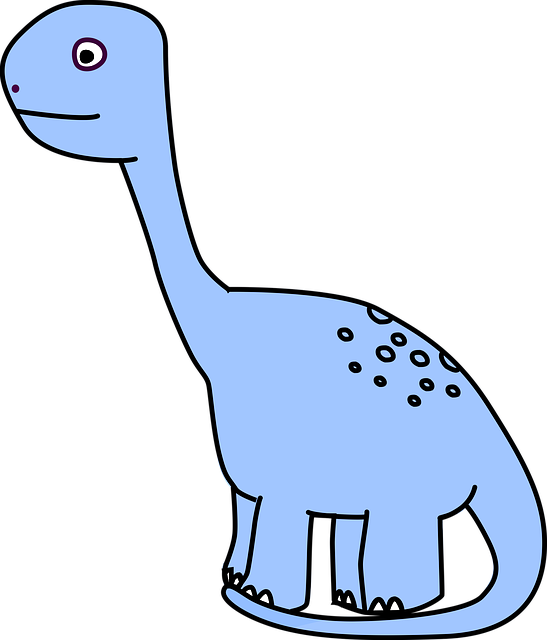

# raspberry_pi_functions
educational app that teaches kids python functions


https://ko-fi.com/birchtree1113

# Python Quest 

Down the rabbit hole I went: I sat down to get familiar with Claude Code, and somehow ended up building an app for Raspberry Pi. The code was generated with Claude's help.

Python Quest is a small, interactive app that teaches kids the basics of Python through a friendly, touchscreen-style interface. It's built with [Pygame](https://www.pygame.org/) and sized for a Raspberry Pi touchscreen (480×320), though it runs fine on a regular desktop too.

## Features

- **Welcome screen** with a short introduction and a dinosaur mascot.
- **Lesson 1 — Functions**: explains what a function is, then lets kids click buttons to see real function code side-by-side with plain-English explanations, and run the code to see the result.
- **Lesson 2 — Guess the Output**: a quiz where kids read a short snippet of Python and pick what they think it will print, with instant right/wrong feedback.

## Credits

Developed by BirchTree

Dinosaur image credit — ArtsyBeeKids


## Requirements

- Python 3
- [Pygame](https://www.pygame.org/) (tested with 2.6.1)

Install the dependency with:

```bash
pip install pygame
